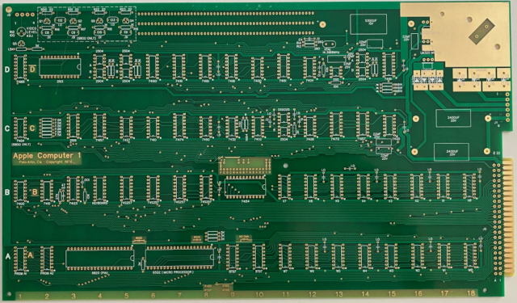

# Apple-1-6800
Apple 1 6800 Clone of the Apple I

# Apple 1, history kinda

Okay not exactly a all the history but the bits and pieces around the Apple 1. The Apple 1 is an interesting computer. It kind of marks the start of the home computer market/revolution (it wasn't first). At the time microcomputer (as opposed to mini and main frame computers) could be bought as kits and usually needed an expensive terminal so the user could interface to it. The TV Typewriter kit by Don Lancaster had come out and allowed you to use a keyboard and a TV instead of a terminal. But the TV typewriter wasn't a computer. The Apple 1 had the terminal part partially built in. You still needed a keyboard and a monitor but a TV could be hooked up instead. And the Apple 1 was a computer. The sale of the Apple 1 kits convince Woz and Jobs to start Apple with the Apple II.

# Notes

I collect vintage computers and have done so before they were vintage. I went to school for electronics at the beginning of the home computer age and later switched to networking and software. I'm still employed in the industry and enjoy the challenge.

So, I went and purchased a couple of Apple I clone boards because of my love of old computers and building electronics. I've done this with other hard to find vintage computers (the SWTPC). Building these computers is fun and brings me back to the early days of computing when I started with electronics and software. Don't get me wrong, I like newer electronics also. I didn't build my Home Automation with any of these these vintage chip sets. Since I can't afford an actual Apple I (or many of the other vintage computers) I grew up with, a clone is a pretty good fit ... well usually. This time I bit off more than I can chew. An entire Apple I clone with all the really hard to find parts can run more than $1000 (US) and I want to build two (one 6502, one 6800). Yup, I should have done a bit more research. Now I've come up with some work-arounds for the expensive video and keyboard sections but I'd still like to build with the actual parts. So I'll have a working Apple I (I hope) and work on getting the unobtainium parts over time. 

Just a note, I'm not even close to being the first to build these boards. Lots of folks have gone this route. Those folks have left great notes and I've found all sorts of interesting information on how to work around all sorts of problems. I'll add the links below so others can take advantage of the information. Also a good search with Apple 1 rather than apple I works better.

# Why a 6800 Apple 1?

I like Motorola CPU and their instruction set. One of my first jobs, out of college, was working with Motorola embedded boards (6800, 6802, 6809 and 68000). So while my first computer is my Atari 800XL I mostly worked with Motorola.

# Licenses

This is going to get a bit crazy but I'll try to figure it out.

- Eric Smith's a1mon68.asm
  - GNU GENERAL PUBLIC LICENSE, Version 3, 29 June 2007
- My (linuxha/Neil Cherry) code/files
  - GNU GENERAL PUBLIC LICENSE, Version 3, 29 June 2007
- Others
  - will figure that out
  
# Assemble wozmon-68 (WIP)

Okay, wozmon-68.asm is really a1mon68.asm by Eric Smith. I'm not trying to steal his code. I just changed the name to avoid confusing myself. I'm working on getting it running under the sim6800 simulator.

## Assemble for the simulator

At the moment (2025/05/26) this doesn't really work well. But it should assemble the wozmon-68.asm file to an S19 file @FF00 (256 bytes). While it assembles it's not working or useful yet. The simulator (sim6800) has an 6850 ACIA @$F000 so I need to write PIA -> ACIA replacement routines.

```
make wozsim.s19
```

## Assemble for the the clone board

I expect this code will work on the clone board.

```
make wozmon.s19
```

# Links

- https://github.com/brouhaha/a1mon68 (a1mon68)
- https://www.applefritter.com/replica
- https://www.applefritter.com/apple1
- https://github.com/linuxha/apple-1-6502
- [Apple 1 World First? Running a 6800 Processor on an Apple 1!](https://www.youtube.com/watch?v=ag6pWUhps7U&t=42s) <- 74L04 instead of a 7400 plus other info
